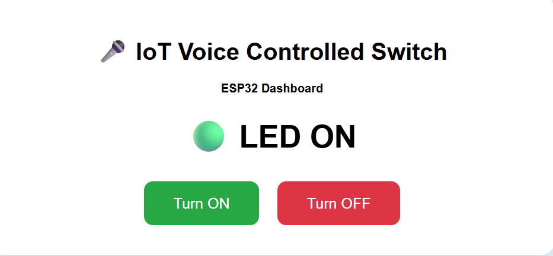
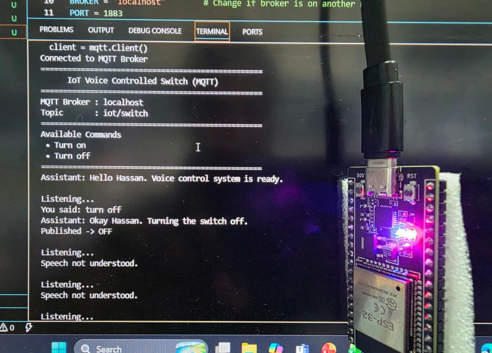

# IoT Voice Controlled Switch (MQTT)

A professional Internet of Things (IoT) Voice Controlled Switch built using an **ESP32**, **Python Speech Recognition**, and the **MQTT communication protocol**.

The system enables users to control an ESP32 remotely using natural voice commands such as:

- **Turn on switch**
- **Turn off switch**

Voice commands are recognized using Python, transmitted through an MQTT broker (Mosquitto), and received by the ESP32, which controls the connected output device in real time.

This project demonstrates how speech recognition, MQTT messaging, embedded systems and IoT networking can be integrated into a smart home automation application.

---

# Project Preview

## ESP32 Web Dashboard



The ESP32 hosts a responsive web dashboard that displays:

- Current LED/Switch Status
- Wi-Fi Connection Status
- Signal Strength (RSSI)
- ESP32 IP Address
- Manual ON/OFF Controls

---

## Voice Assistant



The Python Voice Assistant continuously listens for voice commands and publishes MQTT messages to the ESP32.

Example interaction:

```
Listening...

You:
Turn on switch

Assistant:
Okay Frank. Turning the switch on.

Published:
ON
```

---

# Features

- Voice-controlled switching
- ESP32 Wi-Fi connectivity
- MQTT communication
- Local Mosquitto Broker
- Python Speech Recognition
- Text-to-Speech Voice Feedback
- ESP32 Web Dashboard
- Real-time LED Status Updates
- Manual Dashboard Controls
- Lightweight MQTT Messaging
- Modular Project Structure
- Easy to Extend for Multiple Devices

---

# System Architecture

```
                 Voice Command
                      │
                      ▼
           Python Speech Recognition
                      │
                      ▼
             MQTT Publish (ON/OFF)
                      │
                      ▼
             Mosquitto MQTT Broker
                      │
                      ▼
              ESP32 MQTT Subscriber
                      │
                      ▼
             LED / Relay / Smart Switch
                      │
                      ▼
              ESP32 Web Dashboard
```

---

# ⚙ Technologies Used

## Hardware

- ESP32 Dev Module

---

## Programming Languages

- Python
- C++

---

## Python Libraries

- SpeechRecognition
- PyAudio
- paho-mqtt
- pyttsx3

---

## ESP32 Libraries

- WiFi.h
- PubSubClient.h

---

## Communication Protocols

- MQTT
- HTTP

---

## MQTT Broker

- Eclipse Mosquitto

---

# Project Structure

```
IoT-Voice-Controlled-Switch-MQTT
│
├── arduino/
│   └── ESP32_VoiceSwitch/
│       └── ESP32_VoiceSwitch.ino
│
├── python/
│   ├── main.py
│   ├── mqtt_test.py
│   ├── voice_control.py
│   └── requirements.txt
│
├── images/
│   ├── dashboard.png
│   └── voice_terminal.png
│
├── README.md
├── LICENSE
├── CHANGELOG.md
└── .gitignore
```

---

# 🔧 Installation

## 1. Clone the Repository

```bash
git clone https://github.com/FrankRubandamayonzaMagezi/IoT-Voice-Controlled-Switch-MQTT.git
```

Move into the project folder.

```bash
cd IoT-Voice-Controlled-Switch-MQTT
```

---

## 2. Create a Python Virtual Environment

Windows

```bash
python -m venv venv
```

Activate it

```bash
venv\Scripts\activate
```

Linux/macOS

```bash
python3 -m venv venv
source venv/bin/activate
```

---

## 3. Install Python Dependencies

```bash
pip install -r python/requirements.txt
```

---

## 4. Install Mosquitto MQTT Broker

Download Mosquitto from:

https://mosquitto.org/download/

Verify the installation.

```bash
mosquitto -v
```

Start the broker.

```bash
mosquitto -c mosquitto.conf -v
```

---

## 5. Configure the ESP32

Open the Arduino sketch located in:

```
arduino/ESP32_VoiceSwitch/
```

Update the following values:

```cpp
const char* ssid = "YOUR_WIFI_NAME";
const char* password = "YOUR_WIFI_PASSWORD";

const char* mqtt_server = "YOUR_COMPUTER_IP";
```

Upload the sketch to the ESP32.

---

## 6. Verify MQTT Communication

Subscribe to the topic.

```bash
mosquitto_sub -t iot/switch
```

Publish a test message.

```bash
mosquitto_pub -t iot/switch -m "ON"
```

If everything is configured correctly, the subscriber should receive the message immediately.

---

## 7. Run the Voice Assistant

Navigate to the Python directory.

```bash
cd python
```

Run the application.

```bash
python main.py
```

The assistant will begin listening for commands.

---

#  Supported Voice Commands

Current supported commands include:

```
Turn on switch
```

```
Turn off switch
```

Additional voice commands can easily be added by modifying the Python speech recognition logic.

---

# ESP32 Web Dashboard

The ESP32 hosts a responsive web interface that allows users to:

- View Wi-Fi Status
- View Signal Strength
- View ESP32 IP Address
- Monitor LED Status
- Turn the LED ON
- Turn the LED OFF

Simply open the ESP32 IP address in any web browser connected to the same network.

Example:

```
http://192.168.1.120
```

---

# 📡 MQTT Topics

| Topic | Description |
|---------|-------------|
| `iot/switch` | Receives ON and OFF commands |

Payloads:

```
ON
```

```
OFF
```

---

#  How It Works

1. The user speaks a voice command.
2. Python captures audio from the microphone.
3. SpeechRecognition converts speech into text.
4. The recognized command is published to the MQTT broker.
5. Mosquitto forwards the message to the ESP32.
6. The ESP32 receives the command.
7. The LED or relay is switched ON or OFF.
8. The web dashboard updates automatically to reflect the new state.

---

#  Future Improvements

The project is actively under development.

Future versions will include:

- Cloud MQTT Broker
- Mobile Application
- Google Assistant Integration
- Amazon Alexa Integration
- Home Assistant Support
- Secure MQTT Authentication
- SSL/TLS Encryption
- Over-the-Air (OTA) Updates
- Multiple Smart Devices
- Smart Home Dashboard
- Device Scheduling
- Sensor Monitoring
- Voice Authentication
- Offline Voice Recognition
- AI-based Voice Assistant

---

# Contributing

Contributions are welcome.

If you have ideas for improvements, bug fixes, or new features, feel free to:

- Fork the repository
- Create a new feature branch
- Commit your changes
- Submit a Pull Request

---

# License

This project is licensed under the MIT License.

See the LICENSE file for more information.

---

#  Author

**Frank Rubandamayonza Magezi**

Electrical & Electronics Engineer

Specializing in:

- Internet of Things (IoT)
- Embedded Systems
- Robotics
- Artificial Intelligence
- Automation Systems

GitHub:

https://github.com/FrankRubandamayonzaMagezi

---

# Support

If you found this project useful, please consider giving it a like on GitHub.

It helps support future development and makes the project easier for others to discover.